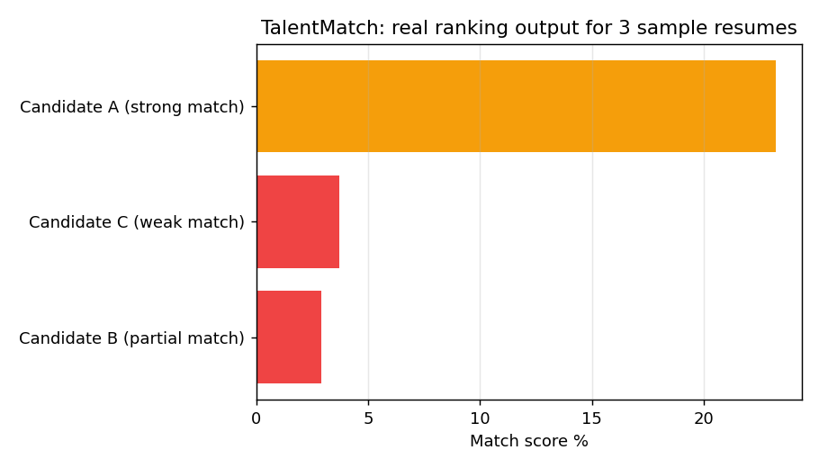

# TalentMatch - AI Resume Screening & Candidate-Job Matching Engine

A recruiter-facing tool that ranks multiple candidate resumes against a single job
description using NLP - built to be model-agnostic so the underlying similarity
engine can be swapped out (TF-IDF today, embeddings tomorrow) without touching the UI.

**Tech Stack:** Python, spaCy (NER), scikit-learn (TF-IDF + cosine similarity), Flask, React.js

## Features
- Upload one job description + **multiple** resumes at once, get a ranked shortlist
- **TF-IDF + cosine similarity** scoring between JD and each resume (bigrams included for phrase-level matching)
- **Keyword-gap analysis** per candidate - see exactly which JD terms are present vs. missing
- **Named entity recognition** (spaCy) surfaces tools, products, and organizations mentioned in each resume
- Model-agnostic scoring pipeline - the `matcher.py` interface is designed so the TF-IDF step could later be swapped for sentence embeddings without changing the API contract

## Sample Output

The chart below is real output from the matching engine, ranking three sample
resumes against a backend developer job description (not a mockup):




## Getting Started

### Backend
```bash
cd backend
python -m venv venv && source venv/bin/activate
pip install -r requirements.txt
python -m spacy download en_core_web_sm
python app.py
```
Server runs on `http://localhost:5000`

### Frontend
```bash
cd frontend
npm install
npm run dev
```
App runs on `http://localhost:5173`

## API
| Method | Endpoint | Description |
|--------|---------------|----------------------------------------------------------------------------|
| POST | `/api/match` | multipart form: `job_description_text` or `job_description` file, plus multiple `resumes` files ranked candidate list |
| GET | `/api/health` | Health check |

## Roadmap
- [ ] Swap TF-IDF for sentence-transformer embeddings for deeper semantic matching
- [ ] Recruiter accounts + saved job postings history
- [ ] Export ranked shortlist as PDF/CSV

---
Built by **Anusha V** - [LinkedIn](https://www.linkedin.com/in/anushav20)
